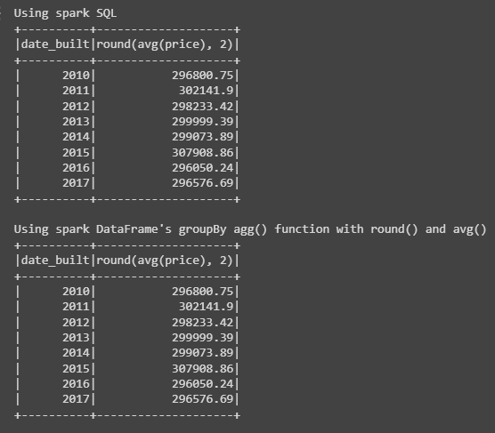
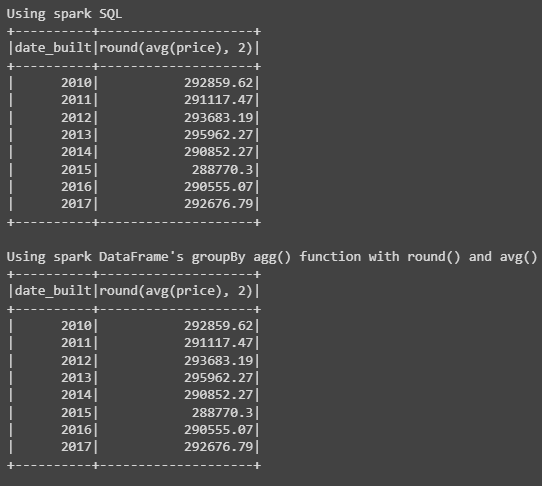
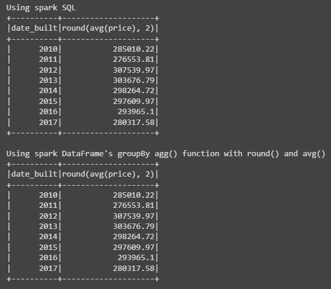
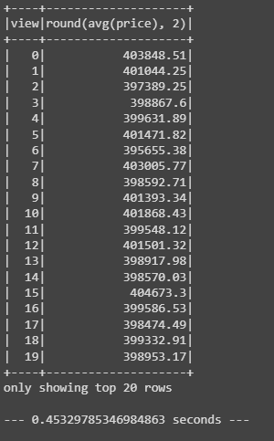
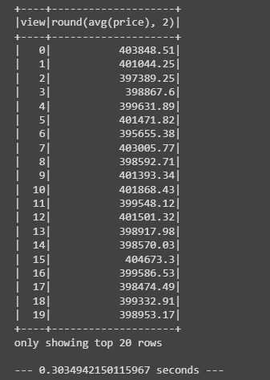
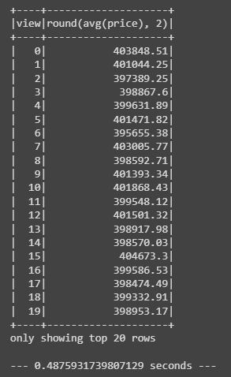

# Home_Sales
GWU Challenge Module 22
---
For this challenge, `SparkSQL` was utilized to determine key metrics about home sales data and where `Spark` was used to create temporary views, partition the data, cached and ucached the temporary table, and verified that the table has been uncached.

Additionally, `Google Colab` was used to perform this challenge instead of the traditional `Jupyter Notebook`.

**Note** - As a challenge to myself and to practice writing codes, I've also included the usage of groupBy function from `PySpark` to perform the same queries for the questions being asked.

## Objectives/Questions
The questions were answered with the outputs as followed:
1.  What is the average price for a four bedroom house sold in each year rounded to two decimal places?

2.  What is the average price of a home for each year the home was built that have 3 bedrooms and 3 bathrooms rounded to two decimal places?

3.  What is the average price of a home for each year built that have 3 bedrooms, 3 bathrooms, with two floors, and are greater than or equal to 2,000 square feet rounded to two decimal places?

4.  What is the "view" rating for the average price of a home, rounded to two decimal places, where the homes are greater than or equal to $350,000? Although this is a small dataset, determine the run time for this query.
    -   Output result without caching.
    
    -   Output result by caching.
    
    -   Output result by partitioning.
    

## Conclusion
This is a great exercise to become more familiar with SQL and `SparkSQL` definitely offered a very quick and easy to use functions when it comes to instantiating, creating a DataFrame then using that DataFrame to write queries with. I've included both the SQL statements and the groupBy output to show at least two ways of obtaining a query result. For a SQL person like me, I would prefer to write out the SQL statement as it is much easier for me and I can see the relationship between the data within the dataset or between tables (if there were more than one).

Finally, the best output for the last question to use was the cached file where the runtime was the shortest even when compared against the partitioned data via `date_built` column. Unfortunately, for this particular dataset, by partitioning out by the `date_built` column, we actually increased the time it took to query something.